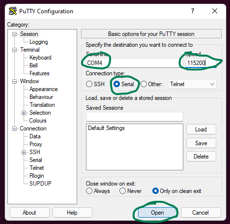
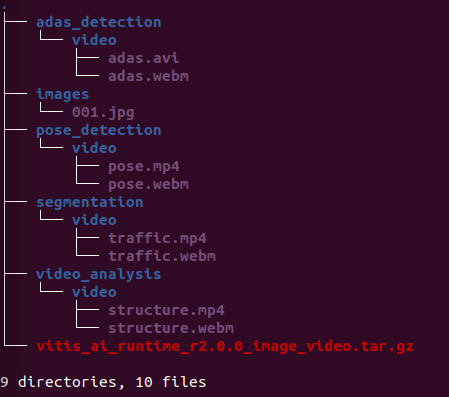
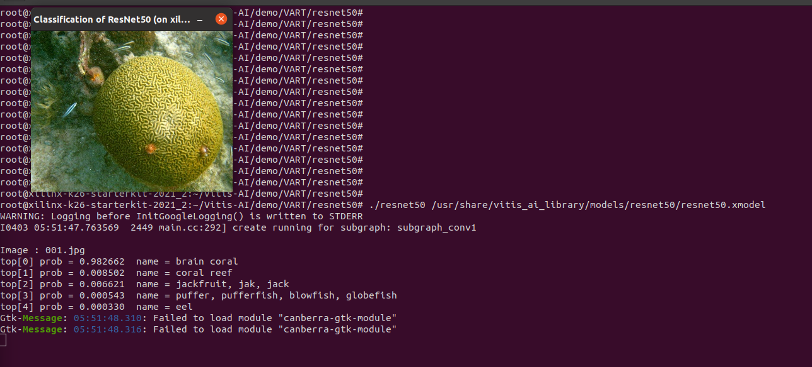
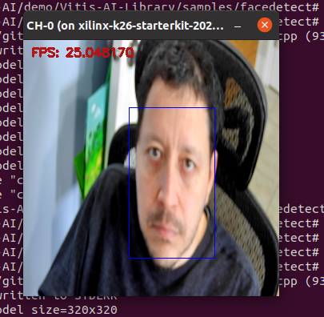
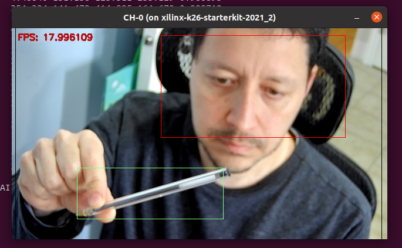

# Kria-KV260 YOLOv4 - Test

## Requirements

This guide is based on [Vitis AI v2.0 - mpsoc/VART](https://github.com/Xilinx/Vitis-AI/tree/v2.0/setup/mpsoc/VART)

### Hardware

- [Kria KV-260](https://www.xilinx.com/products/som/kria/kv260-vision-starter-kit.html), power supply, ethernet cable and micro-USB cable
- [SDcard](https://www.amazon.ca/dp/B073JWXGNT?ref_=cm_sw_r_cp_ud_dp_FDF5A1HAW458SEJRCQZE) (32GB)

### Tools

- [Vitis AI v2.0](https://github.com/Xilinx/Vitis-AI/tree/v2.0)
- [balenaEtcher](https://www.balena.io/etcher/) (or any other application to burn images on SDcards)
- [PuTTY](https://www.putty.org/) (or any other serial terminal)

## Setting up the board

This test uses the [Xilinx MPSoC VART board image](https://github.com/Xilinx/Vitis-AI/tree/master/setup/mpsoc/VART#step2-setup-the-target)

- Download SD card image: [KV260 VART board image](https://www.xilinx.com/member/forms/download/design-license-xef.html?filename=xilinx-kv260-dpu-v2021.2-v2.0.0.img.gz)

```bash
# on Linux
wget https://www.xilinx.com/member/forms/download/design-license-xef.html?filename=xilinx-kv260-dpu-v2021.2-v2.0.0.img.gz
```

- Burn the image to SD card

- Connect the serial port to the board

  - On PuTTY create a new serial port connection with

  |  |
  | :---------------------------------------------------: |

- Power up the board

  The VART test images do not required any login

  ```bash
  [I 2022-04-02 11:10:18.486 ServerApp] Use Control-C to stop this server and shut down all kernels (twice to skip confirmation).
  [C 2022-04-02 11:10:18.507 ServerApp]
  
      To access the server, open this file in a browser:
          file:///home/petalinux/.local/share/jupyter/runtime/jpserver-1537-open.html
      Or copy and paste one of these URLs:
          http://kria_ip:8888/lab?token=168bb9a825a4df642600bfeaf937d413795e694f423450c1
       or http://127.0.0.1:8888/lab?token=168bb9a825a4df642600bfeaf937d413795e694f423450c1
       
  root@xilinx-k26-starterkit-2021_2:~#
  ```

  After power up, write done the IP for `ssh` and `JupyterLab`. The image has a `Petalinux 2021.2` with build (`gcc 10.2.0`) capabilities and `Python 3.8.5`

  ```bash
  # Connect using PuTTY or ssh
  ssh -X root@kria_ip
  
  root@xilinx-k26-starterkit-2021_2:~# cat /etc/lsb-release
  DISTRIB_ID=petalinux
  DISTRIB_RELEASE=2021.2
  DISTRIB_CODENAME=gatesgarth
  DISTRIB_DESCRIPTION="PetaLinux 2021.2"
  
  root@xilinx-k26-starterkit-2021_2:~# gcc --version
  gcc (GCC) 10.2.0
  Copyright (C) 2020 Free Software Foundation, Inc.
  This is free software; see the source for copying conditions.  There is NO
  warranty; not even for MERCHANTABILITY or FITNESS FOR A PARTICULAR PURPOSE.
  
  root@xilinx-k26-starterkit-2021_2:~# python3 --version
  Python 3.8.5
  root@xilinx-k26-starterkit-2021_2:~#
  ```

  - Test connection

    ```bash
    root@xilinx-k26-starterkit-2021_2:~# ping 8.8.8.8
    PING 8.8.8.8 (8.8.8.8) 56(84) bytes of data.
    64 bytes from 8.8.8.8: icmp_seq=1 ttl=116 time=5.90 ms
    64 bytes from 8.8.8.8: icmp_seq=2 ttl=116 time=6.22 ms
    ^C
    --- 8.8.8.8 ping statistics ---
    2 packets transmitted, 2 received, 0% packet loss, time 1002ms
    rtt min/avg/max/mdev = 5.895/6.058/6.222/0.163 ms
    ```

# Running the demos

Two options to run the demos

- Via `ssh -X` (this tutorial)

  `ssh -X root@kria_ip`

- Connect a keyboard, mouse and monitor to the KV260

## Download files

> The image already contains the required files `~/Vitis-AI/demo/VART/` and most of requires models at `/usr/share/vitis_ai_library/models/`
> The next instructions however shows how to download and build all from scratch

- Download Vitis-AI into the board

  ```bash
  mkdir -p ~/repos
  cd ~/repos
  git clone --recurse-submodules https://github.com/Xilinx/Vitis-AI
  ```

- Download the data files for running the examples (VART)

  ```bash
  cd ~/repos/Vitis-AI/demo/VART/
  
  wget https://www.xilinx.com/bin/public/openDownload?filename=vitis_ai_runtime_r2.0.0_image_video.tar.gz -O vitis_ai_runtime_r2.0.0_image_video.tar.gz
  
  tar -xzvf vitis_ai_runtime_r*2.0*_image_video.tar.gz
  ```

  The media files corresponds to each example as follows.

  |  |
  | ----------------------------------------------------------- |

- Download the data files for running the examples (Vitis-AI-Library)

  ```bash
  cd ~/repos/Vitis-AI/demo/Vitis-AI-Library
  
  wget https://www.xilinx.com/bin/public/openDownload?filename=vitis_ai_library_r2.0.0_images.tar.gz -O vitis_ai_library_r2.0.0_images.tar.gz
  
  wget https://www.xilinx.com/bin/public/openDownload?filename=vitis_ai_library_r2.0.0_video.tar.gz -O vitis_ai_library_r2.0.0_video.tar.gz
  
  tar -xzvf vitis_ai_library_r2.0.0_images.tar.gz
  tar -xzvf vitis_ai_library_r2.0.0_video.tar.gz
  ```

## resnet50 ([VART](https://github.com/Xilinx/Vitis-AI/tree/v2.0/demo/VART))

```bash
# Download model: Caffe resnet50
cd ~/repos/Vitis-AI/models/AI-Model-Zoo/
python3 downloader.py
> input:cf resnet50
2 : zcu102 & zcu104 & kv260
> input num:2
done

# untar and copy the model
mkdir -p models
cd models
tar -xzvf ../resnet50-zcu102_zcu104_kv260-r2.0.0.tar.gz
cp -r resnet50 /usr/share/vitis_ai_library/models

# Run the demo
cd ~/repos/Vitis-AI/demo/VART/resnet50
./build.sh
./resnet50 /usr/share/vitis_ai_library/models/resnet50/resnet50.xmodel
```

|  |
| :----------------------------------------------------------: |

> Ignore the canberra-gtk-module (it is a module that [translates GTK+ widgets signals to event sounds](https://askubuntu.com/questions/971560/what-is-the-purpose-of-canberra-gtk-module/971567))

## adas_detection (YOLOv3) (VART)

```bash
# Download model: Darknet YOLOv4
cd ~/repos/Vitis-AI/models/AI-Model-Zoo/
python3 downloader.py
> input:cf resnet50
2 : zcu102 & zcu104 & kv260
> input num:2
done

# untar and copy the model
mkdir -p models
cd models
tar -xzvf ../yolov3_adas_pruned_0_9-zcu102_zcu104_kv260-r2.0.0.tar.gz
cp -r yolov3_adas_pruned_0_9 /usr/share/vitis_ai_library/models

# run the demo
cd ~/Vitis-AI/demo/VART/adas_detection
./build.sh
./adas
```

## facedetect () ([Vitis-AI-Library](https://github.com/Xilinx/Vitis-AI/blob/v2.0/tools/Vitis-AI-Library/README.md#running-vitis-ai-library-examples))

```bash
# Download model: Caffe resnet50
cd ~/repos/Vitis-AI/models/AI-Model-Zoo/
python3 downloader.py
> input:cf densebox
0 : all
> input num:0
2 : zcu102 & zcu104 & kv260
> input num:2
done

# untar and copy the model(s)
mkdir -p models
cd models
tar -xzvf ../densebox_640_360-zcu102_zcu104_kv260-r2.0.0.tar.gz
tar -xzvf ../densebox_320_320-zcu102_zcu104_kv260-r2.0.0.tar.gz
cp -r densebox_640_360 /usr/share/vitis_ai_library/models
cp -r densebox_320_320 /usr/share/vitis_ai_library/models

# run the demo
cd ~/repos/Vitis-AI/demo/Vitis-AI-Library/samples/facedetect
sh build.sh

#./test_jpeg_facedetect densebox_320_320 sample_facedetect.jpg
#./test_video_facedetect densebox_320_320 video_input.webm -t 8

# Connect webcam
./test_video_facedetect densebox_320_320 0 -t 8
> CTRL+C to exit
```

|  |
| :----------------------------------------------------------: |


## YOLOv4 (C++) (Vitis-AI-Library)

```bash
# Download the model(s)
# Darknet YOLOV4
# file(s):
# ../yolov4_leaky_spp_m-zcu102_zcu104_kv260-r2.0.0.tar.gz
# pruned: yolov4_leaky_spp_m_pruned_0_36-zcu102_zcu104_kv260-r2.0.0.tar.gz
python downloader.py
> input:dk yolov4	
0 : all
> input num:0
chose model type
2 : zcu102 & zcu104 & kv260
> input num:2
done

# untar and copy the model(s)
mkdir -p models
cd models
tar -xzvf ../yolov4_leaky_spp_m-zcu102_zcu104_kv260-r2.0.0.tar.gz
tar -xzvf ../yolov4_leaky_spp_m_pruned_0_36-zcu102_zcu104_kv260-r2.0.0.tar.gz
cp -r yolov4_leaky_spp_m /usr/share/vitis_ai_library/models
cp -r yolov4_leaky_spp_m_pruned_0_36 /usr/share/vitis_ai_library/models

# run the demo
cd ~/repos/Vitis-AI/demo/Vitis-AI-Library/samples/yolov4
sh build.sh

#./test_jpeg_yolov4 yolov4_leaky_spp_m_pruned_0_36 sample_yolov4.jpg
./test_video_yolov4 yolov4_leaky_spp_m_pruned_0_36 0
> CTRL+C to exit
```

|  |
| :----------------------------------------------------------: |

